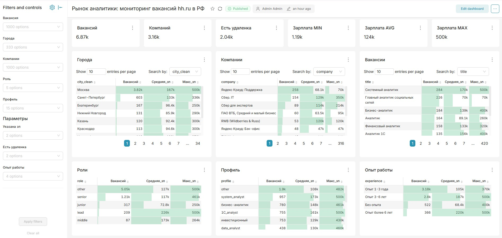
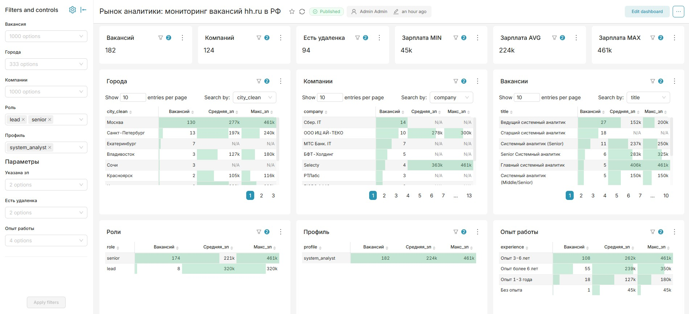
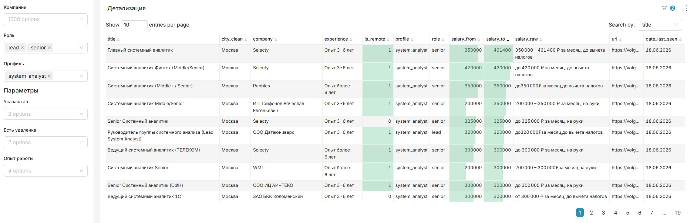

# 📊 Рынок аналитики: мониторинг вакансий hh.ru в РФ

> Парсер вакансий с hh.ru + аналитический дашборд на Apache Superset.  
> Реальный инструмент для мониторинга рынка труда аналитиков в России.


---

## О проекте

hh.ru не предоставляет публичный API для соискателей с декабря 2025 года. Этот проект обходит ограничение через Selenium-парсинг и решает вторую проблему платформы — лимит в 2000 результатов на поисковый запрос.

Собранные данные (~6500+ уникальных вакансий) загружаются в DuckDB и визуализируются в Apache Superset с поддержкой кросс-фильтрации.

**Практическое применение:** отслеживать спрос по городам, уровням, профилям и зарплатным вилкам — в реальном времени.

---

## Дашборд

### Общий вид — весь рынок аналитики


6.87k вакансий, 3.16k компаний, зарплаты от 1.19k до 500k ₽.  
Таблицы по городам, компаниям, вакансиям, ролям, профилям и опыту работы.

### Фильтрация — Senior/Lead системные аналитики


182 вакансии после применения фильтров: роль senior + lead, профиль system_analyst.  
Средняя зарплата 224k ₽, максимум 461k ₽. Москва — 130 вакансий из 182.

### Детализация — конкретные вакансии


Таблица с полным набором полей: название, город, компания, опыт, удалёнка, зарплата (from/to/raw), ссылка, дата последнего обновления.

---

## Архитектура

```
hh.ru
  └─► Selenium + BeautifulSoup   # парсинг страниц вакансий
        └─► pandas DataFrame      # обработка и дедупликация
              └─► DuckDB          # хранение (файловая БД)
                    └─► Apache Superset (Docker)   # дашборд
                                └─► ngrok          # внешний доступ
```

---

## Как устроен парсер

hh.ru ограничивает выдачу 2000 результатами на запрос. Чтобы обойти это, парсер строит **декартово произведение** из 4 измерений:

| Измерение | Значения |
|---|---|
| Регион | Москва / Вся Россия (кроме Москвы) |
| Опыт работы | Без опыта / 1-3 года / 3-6 лет / Более 6 лет |
| Формат работы | Офис / Удалёнка + гибрид |
| Наличие зарплаты | Указана / Не указана |

**32 сегмента × до 2000 вакансий = потенциально 64k результатов.**  
После дедупликации по `vacancy_id` остаётся ~6500 уникальных вакансий.

Поиск ограничен полем `search_field=name` — только вакансии с ключевым словом в названии, без нерелевантных результатов.

---

## Стек

| Компонент | Технология |
|---|---|
| Парсинг | Python 3.9, Selenium, BeautifulSoup |
| Обработка | pandas |
| Хранение | DuckDB |
| Визуализация | Apache Superset (Docker) |
| Внешний доступ | ngrok |
| Разработка | VSCode, DBeaver, Jupyter Notebook |

---

## Запуск локально

### 1. Клонировать репозиторий
```bash
git clone https://github.com/Viktor-VK/Real-time-analytics-hh.git
cd Real-time-analytics-hh
```

### 2. Установить зависимости парсера
```bash
python -m venv venv
venv\Scripts\activate      # Windows
pip install -r requirements.txt
```

### 3. Запустить парсер
```bash
# Открыть notebooks/01_parser.ipynb и выполнить все ячейки
```

Данные сохранятся в `data/hh_vacancies.duckdb`.

### 4. Запустить Superset
```bash
docker build -f Dockerfile.superset -t superset-duckdb .

docker run -d \
  --name superset \
  -p 8088:8088 \
  -v "%cd%/data:/app/data" \
  -v superset_home:/app/superset_home \
  -v "%cd%/pythonpath:/app/pythonpath" \
  -e SUPERSET_SECRET_KEY=your_secret_key \
  superset-duckdb

docker exec superset superset db upgrade
docker exec superset superset init
docker exec superset superset fab create-admin \
  --username admin --firstname Admin --lastname Admin \
  --email admin@admin.com --password admin
```

Открыть: [http://localhost:8088](http://localhost:8088)

---

## Структура репозитория

```
hh_analitics/
├── data/
│   └── hh_vacancies.duckdb     # база данных вакансий
├── notebooks/
│   └── 01_parser.ipynb         # парсер hh.ru
├── logs/
│   └── parser.log              # лог запусков парсера
├── pythonpath/
│   └── superset_config.py      # конфигурация Superset
├── Dockerfile.superset          # образ с DuckDB-драйвером
└── README.md
```

---

## Ветки

| Ветка | Описание |
|---|---|
| `main` | Узкая воронка — только Senior/Lead позиции |
| `wide-funnel` | Широкая воронка — все аналитические роли |

---

*Проект создан как реальный инструмент для мониторинга рынка труда аналитиков и одновременно как портфельный пример data engineering pipeline.*
